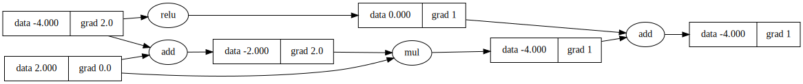

# light

Machine learning in pure lua. Think pytorch but a lot slower

# Examples

## MNIST

It's unusably slow since I do value-level autodiff for API simplicity since Lua overloading is a pain

```
$ lua examples/mnist/main.lua
label   5
. . . . . . . . . . . . . . . . . . . . . . . . . . . .
. . . . . . . . . . . . . . . . . . . . . . . . . . . .
. . . . . . . . . . . . . . . . . . . . . . . . . . . .
. . . . . . . . . . . . . . . . . . . . . . . . . . . .
. . . . . . . . . . . . . . . . . . . . . . . . . . . .
. . . . . . . . . . . . . . # # # . # # # # . . . . . .
. . . . . . . . # # # # # # # # # # # # # # . . . . . .
. . . . . . # # # # # # # # # # # # # # . . . . . . . .
. . . . . . # # # # # # # # # # . . . . . . . . . . . .
. . . . . . # # # # # # . . . # . . . . . . . . . . . .
. . . . . . . . . # # # . . . . . . . . . . . . . . . .
. . . . . . . . . # # # . . . . . . . . . . . . . . . .
. . . . . . . . . . # # # . . . . . . . . . . . . . . .
. . . . . . . . . . . # # # # . . . . . . . . . . . . .
. . . . . . . . . . . # # # # # . . . . . . . . . . . .
. . . . . . . . . . . . . # # # # . . . . . . . . . . .
. . . . . . . . . . . . . . # # # # . . . . . . . . . .
. . . . . . . . . . . . . . . # # # # . . . . . . . . .
. . . . . . . . . . . . . # # # # # . . . . . . . . . .
. . . . . . . . . . . # # # # # # # . . . . . . . . . .
. . . . . . . . . # # # # # # # # . . . . . . . . . . .
. . . . . . . # # # # # # # # . . . . . . . . . . . . .
. . . . . # # # # # # # # . . . . . . . . . . . . . . .
. . # # # # # # # # # . . . . . . . . . . . . . . . . .
. . # # # # # # # . . . . . . . . . . . . . . . . . . .
. . . . . . . . . . . . . . . . . . . . . . . . . . . .
. . . . . . . . . . . . . . . . . . . . . . . . . . . .
. . . . . . . . . . . . . . . . . . . . . . . . . . . .
[epoch 1] loss 0.916 accuracy 0.134 maxw 0.001
[epoch 2] loss 0.836 accuracy 0.706 maxw 0.004
[epoch 3] loss 0.746 accuracy 0.738 maxw 0.007
[epoch 4] loss 0.661 accuracy 0.754 maxw 0.012
[epoch 5] loss 0.603 accuracy 0.763 maxw 0.016
[epoch 6] loss 0.584 accuracy 0.781 maxw 0.018
[epoch 7] loss 0.559 accuracy 0.775 maxw 0.019
[epoch 8] loss 0.566 accuracy 0.791 maxw 0.022
[epoch 9] loss 0.517 accuracy 0.794 maxw 0.022
[epoch 10] loss 0.526 accuracy 0.820 maxw 0.031
```

## Graphviz

Calling `Value:graphviz_dot()` will write [graphviz](https://graphviz.org/) dot language displaying the Autodiff graph to the specified output. For example

```
$ lua examples/graphviz.lua | dot -Tsvg -o examples/graph.svg
```

Gives


